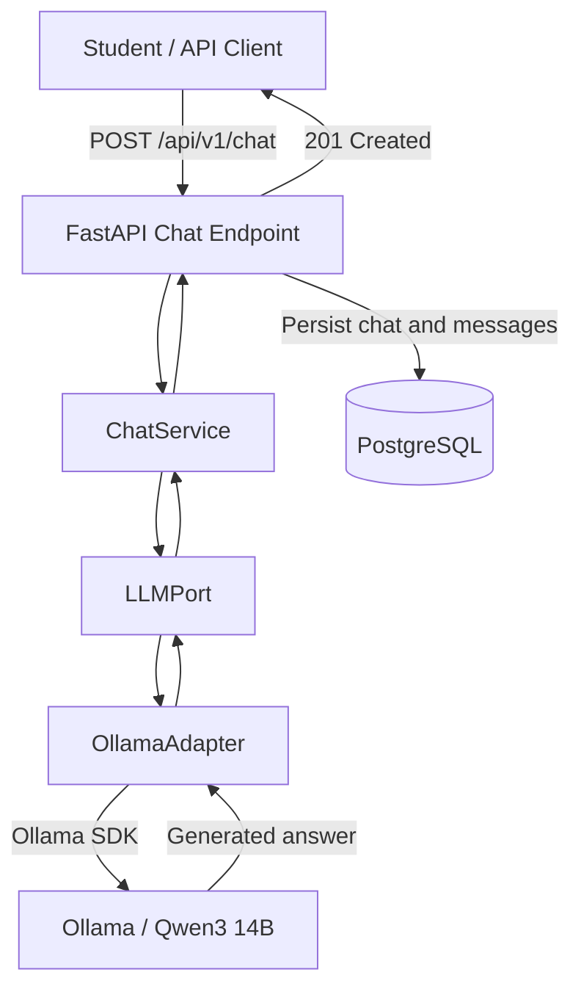

# StudySync — AI Inference Integration

## 1. Overview

StudySync integrates a self-hosted large language model (LLM) with its FastAPI backend to generate responses to student questions.

The current implementation uses:

- **FastAPI:** Handles HTTP requests and responses.
- **ChatService:** Coordinates AI response generation.
- **LLMPort:** Defines a provider-independent inference interface.
- **OllamaAdapter:** Implements the interface using the Ollama Python SDK.
- **Ollama / Qwen3 14B:** Provides self-hosted inference.
- **PostgreSQL:** Stores chat threads and message history.

**Implementation status:** Functional and verified through automated tests and an end-to-end integration test.

Retrieval-Augmented Generation (RAG) is planned but has not yet been implemented.

---

## 2. Architecture



### Component Responsibilities

| Component | Responsibility |
|---|---|
| FastAPI | Validates requests, handles HTTP errors, and persists conversations. |
| ChatService | Exposes the application's answer-generation operation. |
| LLMPort | Defines a common inference interface independent of the model provider. |
| OllamaAdapter | Communicates with Ollama and translates inference errors. |
| Ollama | Hosts the Qwen3 model and executes inference. |
| PostgreSQL | Stores chat threads and associated messages. |

The provider-independent interface allows the inference implementation to be replaced without rewriting the chat endpoint.

---

## 3. Environment Configuration

The backend loads its configuration from environment variables and `backend/.env`.

Example:

```dotenv
AI_PROVIDER=ollama
AI_BASE_URL=http://127.0.0.1:11435
AI_MODEL=qwen3:14b
AI_TIMEOUT=120

DATABASE_URL=postgresql+psycopg://studysync:<password>@127.0.0.1:5432/studysync
```

Replace `<password>` with the locally configured PostgreSQL password. URL-encode reserved characters when necessary.

| Variable | Description |
|---|---|
| `AI_PROVIDER` | Selected inference provider. Currently `ollama`. |
| `AI_BASE_URL` | Address used by the backend to reach Ollama. |
| `AI_MODEL` | Model selected for inference. |
| `AI_TIMEOUT` | Inference request timeout in seconds. |
| `DATABASE_URL` | PostgreSQL connection string used by SQLAlchemy. |

**Security:** Do not commit `.env`, passwords, API keys, or other credentials to the repository.

Each developer should configure the connection addresses appropriate for their environment.

---

## 4. Self-Hosted Inference Setup

The verified development environment uses:

- Ubuntu through WSL for the StudySync backend.
- Fedora for the desktop hosting Ollama.
- An NVIDIA RTX 3090 for model inference.
- Qwen3 14B (`qwen3:14b`) as the initial model.

### 4.1. Verify Ollama on the desktop

Ensure Ollama is running:

```bash
sudo systemctl status ollama
```

Check the installed models:

```bash
ollama list
```

Install the model if necessary:

```bash
ollama pull qwen3:14b
```

Verify that the Ollama API is reachable locally:

```bash
curl http://127.0.0.1:11434/api/tags
```

The response should list the installed model.

### 4.2. Establish the SSH tunnel

The development setup forwards a port on the laptop to Ollama on the desktop:

```text
WSL laptop                     Fedora desktop
127.0.0.1:11435  ---------->   127.0.0.1:11434
                  SSH tunnel
```

On the WSL laptop, run:

```bash
ssh -N -o ExitOnForwardFailure=yes \
  -L 127.0.0.1:11435:127.0.0.1:11434 \
  <desktop-user>@<desktop-ip>
```

Replace the placeholders with the desktop's SSH username and reachable LAN or VPN IP address.

Keep this terminal running while using StudySync.

The tunnel allows the backend to reach Ollama without exposing Ollama's API directly to the network.

### 4.3. Verify connectivity from WSL

Open a second WSL terminal:

```bash
curl --noproxy '*' http://127.0.0.1:11435/api/tags
```

A successful response returns the models installed on the Fedora desktop.

For a direct inference test:

```bash
curl --noproxy '*' --max-time 180 \
  http://127.0.0.1:11435/api/chat \
  -H "Content-Type: application/json" \
  -d '{
    "model": "qwen3:14b",
    "messages": [
      {
        "role": "user",
        "content": "Reply with exactly READY."
      }
    ],
    "stream": false
  }'
```

The JSON response should contain `message.content` with the generated answer.

---

## 5. PostgreSQL Setup

StudySync requires PostgreSQL 17 for structured application data.

Follow the database setup instructions in the repository README to install PostgreSQL, configure a database user, and create the `studysync` database.

Verify that PostgreSQL is accepting connections:

```bash
pg_isready -h 127.0.0.1 -p 5432
```

Configure `DATABASE_URL` in `backend/.env`.

From the backend directory, verify that the application loads the setting without printing credentials:

```bash
uv run python -c "from src.core.config import settings; print(bool(settings.database_url))"
```

Expected output:

```text
True
```

Initialize the schema:

```bash
uv run python -c "from src.db.session import init_db; init_db()"
```

This initializes the tables defined in the current SQLAlchemy metadata.

---

## 6. API Request and Response Flow

### 6.1. Create a chat

**Endpoint:**

```http
POST /api/v1/chat
Content-Type: application/json
```

**Request body:**

```json
{
  "course_id": "CS537",
  "question": "Explain the difference between a process and a thread."
}
```

### 6.2. Request processing

The backend performs the following operations:

1. FastAPI validates the incoming request.
2. FastAPI resolves the database and ChatService dependencies.
3. ChatService passes the question to LLMPort.
4. OllamaAdapter sends the question to Ollama.
5. Qwen3 generates an answer.
6. OllamaAdapter validates and returns the generated content.
7. FastAPI creates a chat thread and two message records.
8. SQLAlchemy commits the conversation to PostgreSQL.
9. FastAPI returns the saved conversation.

The conversation is saved only after successful inference.

### 6.3. Successful response

**Status:** `201 Created`

Illustrative response:

```json
{
  "chat_id": "example-chat-id",
  "course_id": "CS537",
  "question": "Explain the difference between a process and a thread.",
  "answer": "A process has its own address space, whereas threads within a process share an address space and other resources.",
  "created_at": "2026-09-17T21:48:50-05:00",
  "updated_at": "2026-09-17T21:48:50-05:00",
  "messages": [
    {
      "role": "user",
      "content": "Explain the difference between a process and a thread.",
      "created_at": "2026-09-17T21:48:50-05:00"
    },
    {
      "role": "assistant",
      "content": "A process has its own address space, whereas threads within a process share an address space and other resources.",
      "created_at": "2026-09-17T21:48:50-05:00"
    }
  ]
}
```

The example above is illustrative; actual IDs, timestamps, and generated answers will vary.

### 6.4. Retrieve a saved chat

**Endpoint:**

```http
GET /api/v1/chat/{chat_id}
```

Example:

```bash
curl --noproxy '*' \
  http://127.0.0.1:8000/api/v1/chat/<chat_id>
```

Replace `<chat_id>` with the identifier returned by the POST request.

The endpoint retrieves the stored conversation and associated messages from PostgreSQL.

---

## 7. Error Handling

The chat endpoint handles inference failures using the application's provider-independent exception types.

| Condition | HTTP Status | Behavior |
|---|---|---|
| Successful generation and persistence | `201` | Return the created chat. |
| Inference service unavailable or transport failure | `503` | Return a service-unavailable error. |
| Inference provider rejects the request or returns invalid content | `502` | Return an upstream inference error. |
| Invalid request body | `422` | Reject the request through FastAPI validation. |

If inference fails, the application does not create a completed chat record.

Database configuration and persistence failures are separate from inference errors. An unhandled database failure may currently result in HTTP `500`.

---

## 8. Testing and Verification

### 8.1. Automated tests

From `backend/`, run:

```bash
uv run python -m unittest discover -s tests -v
```

The existing suite contains six tests covering:

**Ollama adapter:**

- Successful text generation.
- Connection failures.
- Ollama API errors.
- Empty responses.

**FastAPI integration:**

- Chat generation and persistence using a fake LLM.
- Failed inference does not create a chat.

The six tests passed during development.

These tests use a simulated inference client; they do not require the desktop GPU.

### 8.2. End-to-end integration test

Start PostgreSQL, verify that the SSH tunnel is active, and run FastAPI:

```bash
cd backend
uv run uvicorn src.main:app --reload
```

In another WSL terminal, submit a chat request:

```bash
curl -i --noproxy '*' --max-time 180 \
  -X POST http://127.0.0.1:8000/api/v1/chat \
  -H "Content-Type: application/json" \
  -d '{
    "course_id": "CS537",
    "question": "Explain the difference between a process and a thread in two sentences."
  }'
```

**Expected result:** HTTP `201 Created`, a generated answer, a chat ID, and both user and assistant messages.

Next, retrieve the conversation:

```bash
curl --noproxy '*' \
  http://127.0.0.1:8000/api/v1/chat/<chat_id>
```

Confirm that the same conversation is returned from PostgreSQL.

### Verified development results

- Successful SSH connectivity to desktop Ollama.
- Successful inference with Qwen3 14B.
- Successful FastAPI chat creation (`201 Created`).
- Successful retrieval of the stored conversation.
- Two messages returned: one user message and one assistant message.
- Stored question matched the user message.
- Stored answer matched the assistant message.
- All six automated tests passed.

---

## 9. Current Limitations

The following capabilities are not yet implemented:

- Retrieval of course documents through RAG.
- Pinecone vector search.
- Source-grounded answer generation and citations.
- Inclusion of earlier messages as context for new questions.
- Live model-token streaming.

The existing chat streaming endpoint replays a previously saved answer rather than streaming tokens directly from Ollama.

The current `POST /api/v1/chat` endpoint generates a complete answer synchronously before storing and returning the conversation.

These capabilities will be addressed in future development.

---

## 10. Related Documentation

- [Project README](../../README.md) — General setup and PostgreSQL configuration.
- [RAG Workflow](rag-workflow.md) — Planned document ingestion and retrieval architecture.

The RAG workflow is a planned design and should not be confused with the currently implemented inference integration.