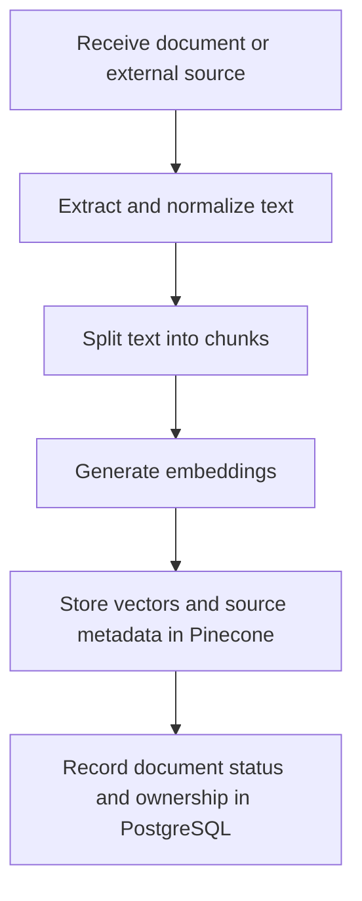
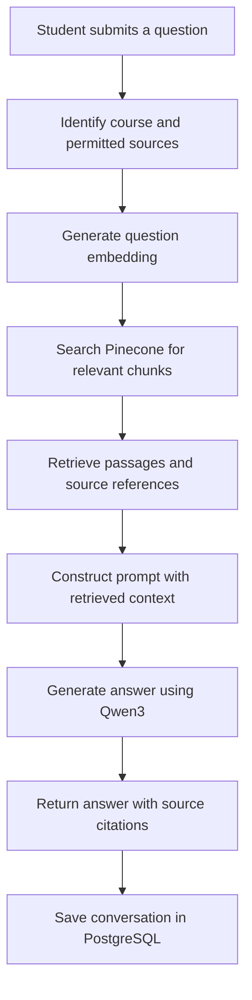

# StudySync — RAG Workflow

## Overview

StudySync will use Retrieval-Augmented Generation (RAG) to generate answers grounded in course materials and external sources.

The RAG system consists of two primary workflows:

1. Document ingestion
2. Question answering

**Status:** Planned architecture. RAG is not yet implemented.

---

## 1. Document Ingestion Workflow

This workflow processes uploaded course materials and external sources so they can be retrieved when students ask questions.

### Component Responsibilities

| Component | Responsibility |
|---|---|
| FastAPI | Accept document uploads and source requests. |
| LlamaIndex | Coordinate text extraction, chunking, and indexing. |
| Embedding model | Convert document chunks into vector representations. |
| Pinecone | Store and index vectors with source metadata. |
| PostgreSQL | Maintain document records, ownership, and processing status. |

### Required Metadata

Each indexed chunk should include:

- `course_id`
- `document_id`
- `chunk_id`
- Source reference
- Page number or section, when available

The ingestion process must preserve enough information to associate retrieved passages with their original sources.

Document records should be created in PostgreSQL when ingestion begins and updated as processing progresses. Failed ingestion should be recorded without marking the document as successfully indexed.

Original-file storage remains an architectural decision.

---

## 2. Question Answering Workflow

This workflow retrieves relevant course information before generating an answer.

### Component Responsibilities

| Component | Responsibility |
|---|---|
| FastAPI | Receive questions and return answers. |
| ChatService | Coordinate the question-answering process. |
| LlamaIndex | Orchestrate retrieval and context preparation. |
| Embedding model | Convert questions into vectors compatible with the document index. |
| Pinecone | Retrieve relevant course-material chunks. |
| Qwen3 | Generate answers using the retrieved context. |
| PostgreSQL | Preserve chat threads and message history. |

### Retrieval Requirements

- Restrict retrieval to sources the requesting user is authorized to access.
- Filter results by the relevant course when applicable.
- Preserve references linking retrieved passages to their documents.
- Handle cases where no relevant supporting material is found.
- Do not present unsupported answers as grounded in course content.

---

## 3. Current Implementation vs. Planned Work

| Functionality | Status |
|---|---|
| FastAPI chat endpoint | Implemented |
| Self-hosted Ollama and Qwen3 | Implemented |
| PostgreSQL chat persistence | Implemented |
| Document ingestion | Planned |
| Embedding generation | Planned |
| Pinecone retrieval | Planned |
| Source-grounded answers and citations | Planned |

## 4. Open Architectural Decisions

- Select and validate the embedding model.
- Decide where original uploaded documents will be stored.
- Define chunk sizes and overlap.
- Define retrieval parameters and relevance thresholds.
- Finalize source citation formatting.
- Establish ingestion retry and failure-handling behavior.